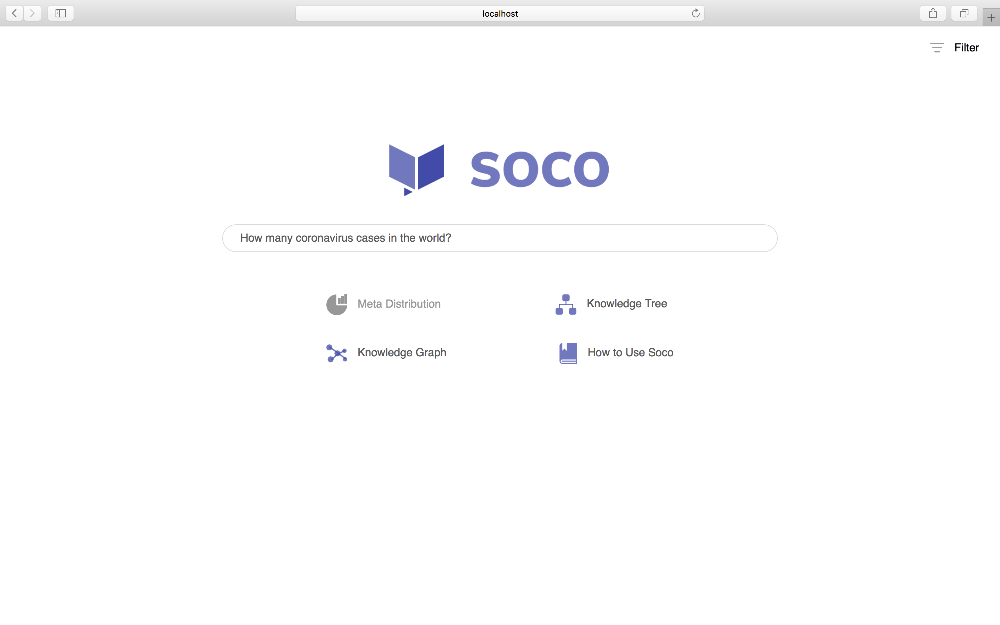

# SOCO UI React

[](https://github.com/soco-ai/soco-ui-react)

SOCO UI React is an open source web application built mainly with [React](https://facebook.github.io/react/), [Ant Design](https://ant.design/), [Bootstrap](http://getbootstrap.com/), [React Router](https://reacttraining.com/react-router/),
[Redux](http://redux.js.org/), [Webpack](https://webpack.js.org/) and [Node.js](https://nodejs.org/en/). It is a bundle of the entire preview page of your pretrained SOCO tasks using [SOCO Python Package](https://docs.soco.ai) and [SOCO Dashboard](https://app.soco.ai).

Users can get the source code of the SOCO preview pages, including the search bar with autocompletion and the several types of search results (Q&A, Response Clusters, Meta Distribution, Knowledge Tree, Knowledge Graph, Keywords and so on). They can also fork the repository and develop the pages with their own designs.

## Table of Contents

- [Demo](#demo)
- [Development](#development)
    - [Open Task and Train Data](#open-task-and-train-data)
    - [Local Development](#local-development)
        - [Get Query API Key](#get-query-api-key)
        - [Run the Project](#run-the-project)
        - [Revise the Project](#revise-the-project)
        - [Deploy the Project](#deploy-the-project)
- [Copyright and License](#copyright-and-license)

## Demo

We insert one example task for users to use, [Covid-19 Papers](https://app.soco.ai/main/covid-19). This two links will direct users to the public webpages. Users can also play around with them locally.

```shell
# Clone the repository
$ git clone https://github.com/soco-ai/soco-ui-react.git
$ cd soco-ui-react

# Run npm commands
$ npm i
$ npm run build

# Open another tab in the shell and run the following command
$ npm start
```

One more thing. Create .env file and add the following two environment varibales.

```text
BOT_URL=https://api.soco.ai
QUERY_API_KEY=78f0299c-17b2-4851-83c6-06d9856de42a
SOCO_URL=https://app.soco.ai
```

Now go to <http://localhost:3031> try it out! We post screenshots of the Covid-19 Papers task below.




## Development

In order to better use SOCO UI React, users can work with [SOCO Python Package](https://docs.soco.ai) and [SOCO Dashboard](https://app.soco.ai) to development their own preview pages.

### Open Task and Train Data

First, user can register on [SOCO Dashboard](https://app.soco.ai), create a new task, upload and train document/faq data with [SOCO Python Package](https://docs.soco.ai). There is a good Medium post about this preprocess. Check it out here: [How to build a question answering (QA) system from your documents](https://medium.com/soco-ai/how-to-build-a-question-answering-qa-system-from-any-documents-f27b038b1642)

### Local Development

#### Get Query API Key

Log in user's account on SOCO Dashboard. Select one task and click the task name to enter the task setting page. On the left column, find the "API Keys" and click the button to copy the "QUERY_API_KEY" (See the screenshot below).


Then paste it in .env file to replace the default ```QUERY_API_KEY``` like the following code.

```text
QUERY_API_KEY=xxxxxxxx-xxxx-xxxx-xxxx-xxxxxxxxxxxx
```

#### Run the Project

Run the following to bundle files and watch changes.

```shell
$ npm run build
```

Then, run the following command to start servers.

```shell
$ npm start
```

After that, go to <http://localhost:3031> to check the training result.

#### Revise the Project

Users can edit the project in several ways, like tweaking React components, building database of users own and programming their APIs in Node.js (Use "serverUrl" in "client > src > configs.js" to make API call on frontend).

Every time after users make changes on frontend, refresh the page to see the changes. Every time whe users make changes on the backend, restart the server to see the changes.

#### Deploy the Project

There are several platforms for deployment, such as [Docker Hub](https://hub.docker.com/), [Heroku](https://www.heroku.com/), etc.

Before push and deploy, kill build process (```$ npm run build``` and ```$ npm start```) and run the following command to bundle the files in production mode.

```shell
$ npm run prepublishOnly
```

## Copyright and License

Copyright @ [SOCO.AI](https://www.soco.ai)